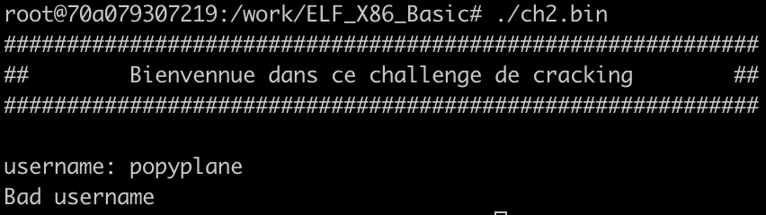
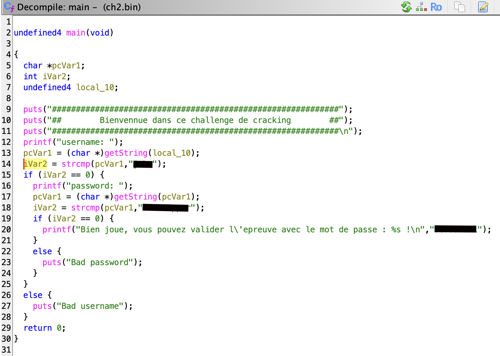

# Root-Me Challenge Write-Up

## 1. Challenge Information


| **Challenge Name** | `ELF x86 - Basique` |
| --- | :---: |
| **Category** | `[Reverse] [Crackme]` |
| **Difficulty** | `Beginner` |
| **Link** | [root-me.org](https://www.root-me.org/fr/Challenges/Cracking/ELF-x86-Basique) |

---

## 2. Objective

> We are given an ELF (standing for Executable and Linkable Format) and we should find the password to validate the challenge.

---

## 3. Provided File

* `[ch2.bin]`

---

## 4. Initial Reconnaissance (Recon)

### ⚙️ Tools & Output

* **`file ch2.bin`**
    * **Result:** 
	```bash
	ch2.bin: ELF 32-bit LSB executable, Intel 80386, version 1 (SYSV),
	statically linked, for GNU/Linux 2.6.8, with debug_info, not stripped
	```
* **`strings ch2.bin`**
    * **Suspicious Strings:**
        The `strings` output was very large (~4000 lines), which is normal for ELF binaries because they include many library-related strings, metadata, and compiled constant data.
        To filter useful information, I inspected the output with a pager (`strings file | less`) and searched for meaningful keywords (e.g., "Enter", "Password", "Name").
        A few readable prompts related to user interaction were visible, but nothing directly revealing the solution.

* **`./ch2.bin`**
	* **I launched a Docker to be able to run the program**
		Here is a screenshot of the program:



---

## 5. Static Analysis (Reverse Engineering)

1. **Open in Decompiler:**
   I opened the binary in **Ghidra** and launched the automatic analysis.

2. **Locate Main Logic:**
   After the analysis completed, I navigated to the `main()` function. The program’s entire validation logic is implemented directly inside this function.

3. **Validation / Transformation Logic:**
   - The program first asks the user for a **username** and compares it with a hardcoded string using `strcmp()`.
   - If the username is correct, it then prompts for a **password**, also checked through a plain-text `strcmp()` against another static string.
   - There is **no obfuscation, cipher, or transformation** involved. All expected values are stored in clear text in the binary.
   - The sequence is straightforward:
     **input username > compare > input password > compare > display success message**.



---

## 6. Solution Analysis

1. **Initial Insight:**  
   During static analysis, Ghidra showed that both the username and password were hardcoded as plain strings inside the `main()` function.  
   The program simply compares the user input to these strings using `strcmp()` — no hashing, no encoding, no transformation.

2. **How the Validation Works:**
   - Prompt user for username
   - Compare using `strcmp(user_input, expected_username)`
   - If valid → prompt for password
   - Compare using `strcmp(user_input, expected_password)`
   - If both match → print the success message including the final answer

3. **Derivation Method:**
   Since the expected values were stored *in clear text* in the binary, the solution was obtained by reading them directly in Ghidra's decompiler view.
   No reversing or computation was required—only identification of the strings used in `strcmp()`.

4. **Final Result:**
   Once the correct username and password are provided to the program, it prints the success banner containing the challenge answer.

*(I do not include the raw strings here to respect Root‑Me’s policy and avoid spoiling the challenge.)*

---

## 7. Final Answer

The answer is printed by the program after entering the correct username and password recovered from the binary.

---

## 8. Notes / Lessons Learned

* Hardcoded credentials are extremely common in beginner reversing challenges.
* The presence of plain `strcmp()` calls is a strong indicator that no transformation or crypto is applied.
* Using a decompiler like Ghidra is often faster and more reliable than trying to brute‑force logic dynamically.
* Filtering `strings` output with a pager (`less`) or searching for specific keywords saves time when binaries contain thousands of unrelated strings.

